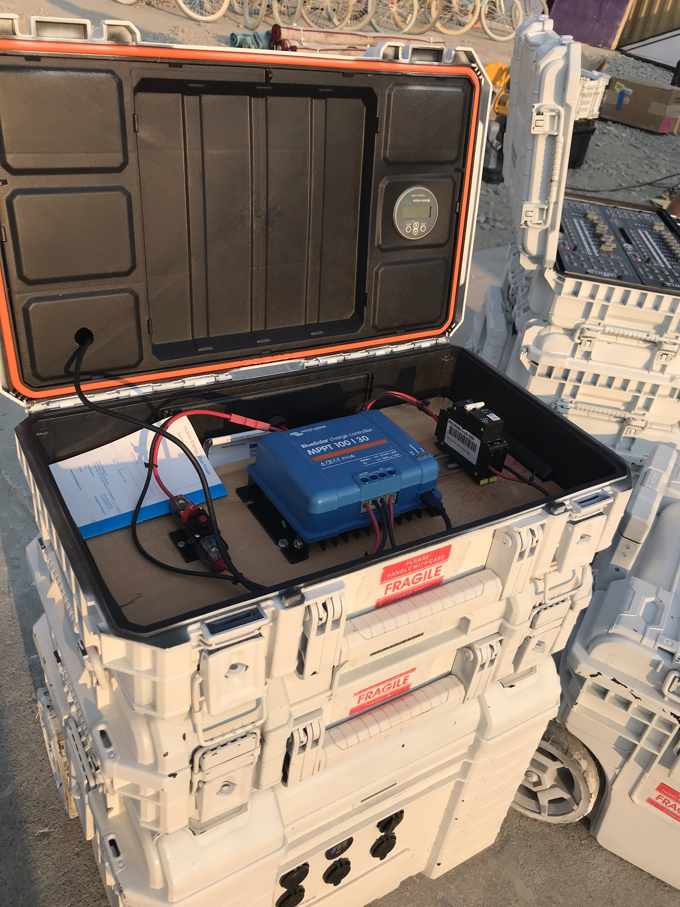
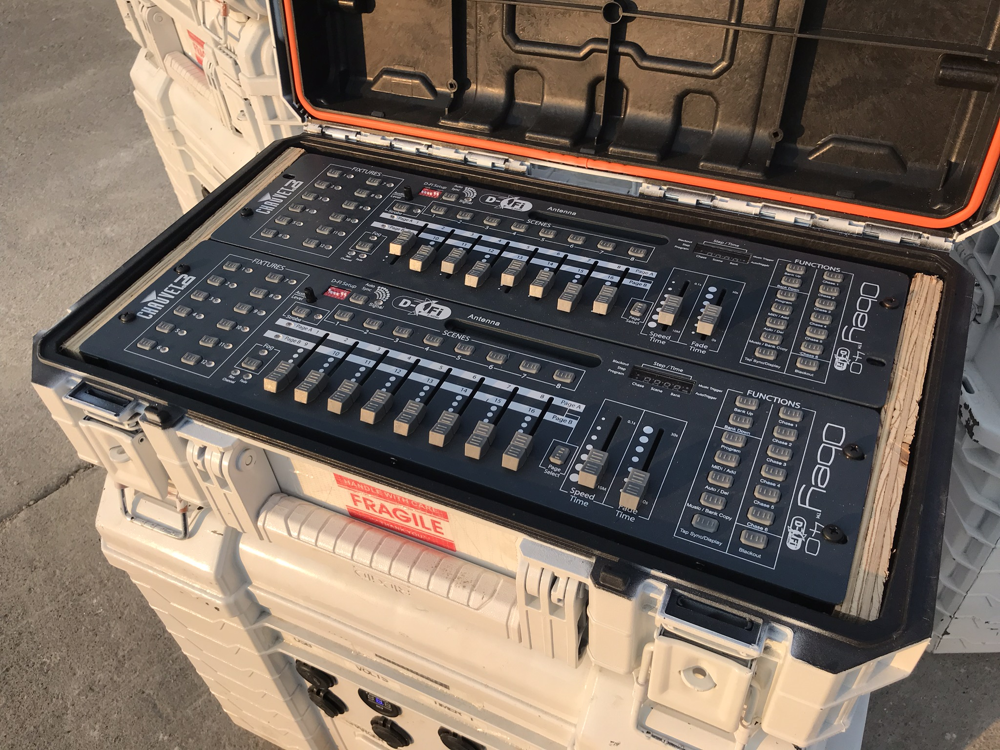
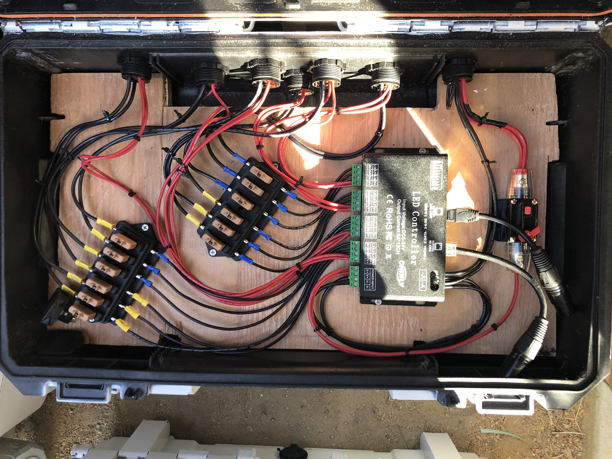

# Arc
A nifty way to build modular off grid solar power systems.

## Overview
This system was primarily designed to provide 30kwh of daily capacity for our Burning Man camp. It creates a 25.6vdc electricity grid because we have found that to be best compromise in terms of energy efficency and appliance requirements. 25.6vdc also allows for longer cable runs then for example the well adopted automobile 12vdc standard.

Given that this is not super common versus regular 110-220vac public grid power we also started to design custom appliances and retrofit existing ones. Most electronics work with DC power interally anyways which makes retrofitting simple and comes with significant power efficeny benefits.

### Advantages:
* Cheaper than off the shelf solutions
* Easy to extend vertically (by adding more Arcs)
* Highly power efficent
* No off season maintenance required
* Outdoor (Playa) proof

### Appliance types we run:
* Lights (24vdc LED fixtures)
* PA System (we used to run a custom 2kw RMS PA and have upgraded to 20kw system this year)
* Fridges (there are a bunch of 24v fridges available on the market)
* Water pumps (there are a bunch of 24v ones available on the market)
* Various low voltage (5-12vdc) appliances such as DMX controllers, wifi access points, ipads, etc. (those can easily be fed by using cheap and efficent step down voltage converters)

## Features
* 2x 15a Always-on outlets with breakers
* 2x 15a Timer controller outlets with breakers
* 2x USB outlets with breaker
* 1x External system voltage display
* 1x 30a charge inlet with breaker and overcharge protection
* Battery cell load balancing
* Under/over charge protection
* Under/over voltage protection
* Smart system monitoring cpu

## System Architecture
The system is designed to consist of multiple independent units which allows for simpler deployment along a larger perimeter, reducing complexity and increasing redundancy.

For added flexibility we seperated the battery and controller from the solar charge controller because for some usecases (single day events) we don't need the solar piece (Arcs can also be charged from the public 110-220vac power grid).

We run 9x Arcs for our camp at this time. Each one of them has 2,560kwh storage capacity for a total of 23kwh. Each Arc gets charged by two in series 350w solar panels (running the panels in series doubles the voltage and allows for longer cable runs at minimum loss).

## Arc components
At a high level each arc consists of two modules:
* Arc itself
  * Battery
  * Battery management controller
  * Breakers
  * Timers (to automatically control lights at night)
  * Housing
* Solar charger
  * Solar charge controller
  * Breakers
  * System management interface
  * Housing

[Arc v2 parts list](arc_v2_parts_list.csv)

## Wiring diagram
Make sure to use the right wiring AWG. We used 6, 10 and 14AWG. Generally you'll want your wires thick enough for the breaker to be the weakest point!

## Housing
The housing of our v1 arcs was custom plywood boxes... and those sucked because they were too heavy, took too much time to build and were too expensive among other issues. Our housing needed to be highly mobile, robust, water proof and cheap! Hence we decided to use Ridgid Toolboxes which meet all these requirements and can be easily purchased at any Home Depot. They are also stack- and interlock-able!

We spray painted them white to reduce heat from the sun. Yes, we leave them out in the weather (at Burning Man which is super harsh: sun, heat, cold, wind, dust, rain, etc.)

These toolboxes also fit 19" components which comes in handy to house industry standard rack mount gear.

## Battery
Our previous system used Lead Acid batteries, but those ended up being a poor choice given that they shouldn't be discharged beyond 50% of their capacity and can't be stored off season without frequent maintenance charges.

Hence we ended up picking LiFePo4 chemistry batteries which are very safe, robust, lightweight, maintenance free and can be used to almost 100% of their capacity! 

## Cables
Using a system voltage of 25.6vdc allows for long cable runs using 12AWG cable.

Example: A 75ft long 12AWG cable can support a load up to 100w!

[Cable length table](cable_length_table.csv)

You will say "But Doc, 75ft will never be long enough!" ...which is why we have mulitple Arcs across the perimeter to keep cable lengths short :)

## Connectors
Based on previous experience we decided to use pp45 Anderson Powerpole connectors which support up to 45amp loads and a bi-directional.

## Custom Appliances
Having a 24v grid required us to build some appliances from scratch:

### PA Amp
Among other we built a custom 2kw RMS amp that works off 24v and only needs 4 amps per hour!

We are currentely working on a V2 and hope to post detailed plans during winter of 2019.

### DMX LED Dimmer pack
To control our LED fixtures via DMX we built two of these 12ch babies that can drive 5a per channel (capped to 30a peak).

## Known issues
* When the battery gets completely drained sometimes the charge controller won't come on in the morning and needs a power cycle to correctly read the abttery status

## Todo's
* Simplify status monitoring
* Simplify tracking down and fixing issues
* Maximize hardware utilization (timers are ok, but a dynamic system would be better)
* Simplify assembly and reduce costs
* Mass manufacturable
* Inter arc load balancing

## Thanks
* Mark Omerod for starting this project in 2015
* Kuy Mainwaring for being part of the brain trust around this over the years
* Drew Moxon for really being the man enabling me and my silly ideas
* All the amazing souls at Hotel California for making this happen

## License
Copyright (c) 2015-2019 Matthias Wagner

## Safety Disclaimer
This project and the material covered is for informational purposes only. We take no responsibility for what you do with this knowledge. We can not be held responsible for any property or medical damages caused by items you read about here. We would advise you to check your local laws. Some of the items we refer to are illegal in some areas, and we would highly advise you against building these in said areas.

The material is for informational purposes only. By taking any information or education material, you assume all risks for the material covered. You agree to indemnify, hold harmless, and defend this project from any and all claims and damages as a result of any and all of the information covered.

By taking and/or using any informational resources from this project, you agree that you will use this information in a safe and legal manner, consistent with all applicable laws, safety rules, and good common sense. You further agree that you will take such steps as may be reasonably necessary or required by applicable law to keep any information out of the hands of minors and untrained and/ or immature individuals.
